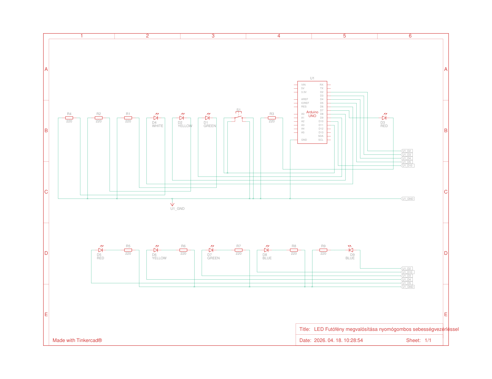

Arduino led futófény

Projekt leiras:
Ez a projekt az Arduino unoval történő futófény megvalósítása.

Működés:
- több LED-et vezérel,
- oda-vissza mozgást valósít meg,
- gomb vezérléssel szabályozható működés

Felhasznált eszközök:
- 9 db LED,
- 9 db 220 ohm os ellenállás,
- Arduino Uno,
- 1 db nyomógomb,
- kábelek

Kapcsolási rajz:

PDF formátumban is elérhető:  
docs/kapcsolasi_rajz.pdf

Működés:
A gomb megnyomására 3 különböző működést oldd meg a rendszer:
Háromm különböző sebességű műküdés:
- lassú,
- közepes,
- gyors

A teljes program a következő fájlban található:  
futofeny.ino

Dokumentáció

A beadandó teljes dokumentáció PDF formátumban:  
Digitalis_technika_II_beadando

Készítette

Mitku László  
Mérnökinformatikus BSc  
Digitális technika II
